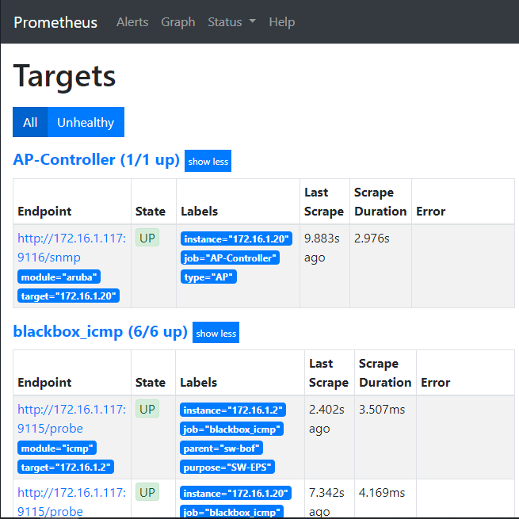

# SNMP_Monitor

- SNMPを使い、ネットワーク機器を監視する

## 確認した環境

``` docker
> docker version
Client: Docker Engine - Community
 Version:           19.03.1
 API version:       1.40
 Go version:        go1.12.5
 Git commit:        74b1e89
 Built:             Thu Jul 25 21:21:05 2019
 OS/Arch:           linux/amd64
 Experimental:      false

Server: Docker Engine - Community
 Engine:
  Version:          19.03.1
  API version:      1.40 (minimum version 1.12)
  Go version:       go1.12.5
  Git commit:       74b1e89
  Built:            Thu Jul 25 21:19:41 2019
  OS/Arch:          linux/amd64
  Experimental:     false
 containerd:
  Version:          1.2.6
  GitCommit:        894b81a4b802e4eb2a91d1ce216b8817763c29fb
 runc:
  Version:          1.0.0-rc8
  GitCommit:        425e105d5a03fabd737a126ad93d62a9eeede87f
 docker-init:
  Version:          0.18.0
  GitCommit:        fec3683
```

```
> uname -a
Linux hoge 4.15.0-58-generic #64-Ubuntu SMP Tue Aug 6 11:12:41 UTC 2019 x86_64 x86_64 x86_64 GNU/Linux
```

## 立ち上げ

```docker-compose.yml
> docker-compose up 
```

## 確認

Prometheusのターゲットから疎通性があることを確認した.
